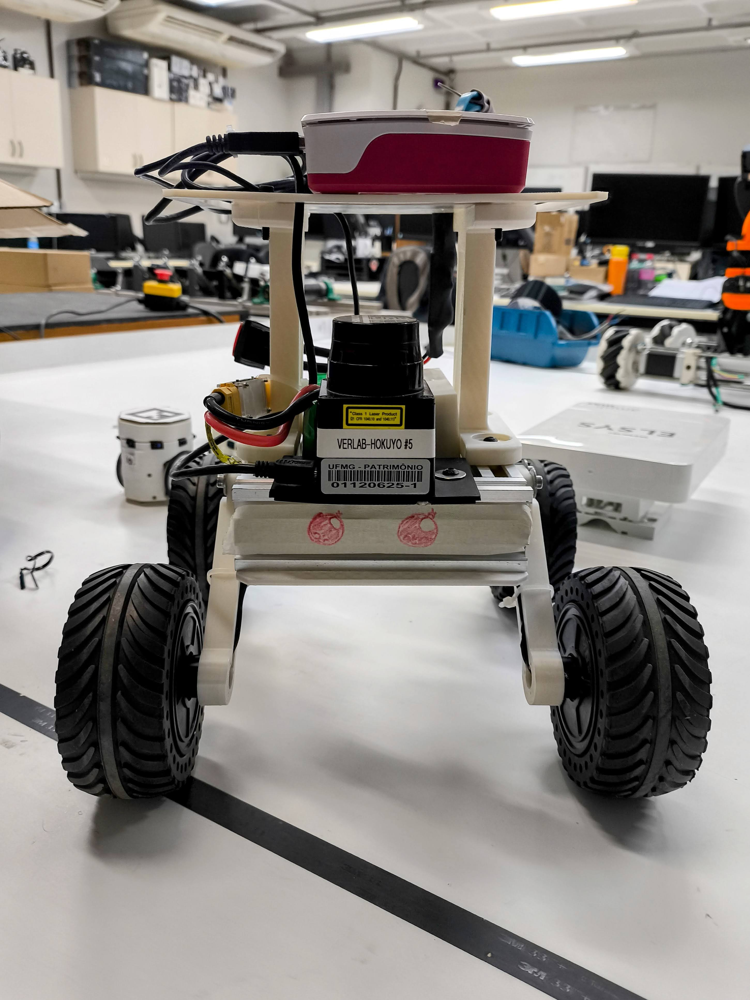
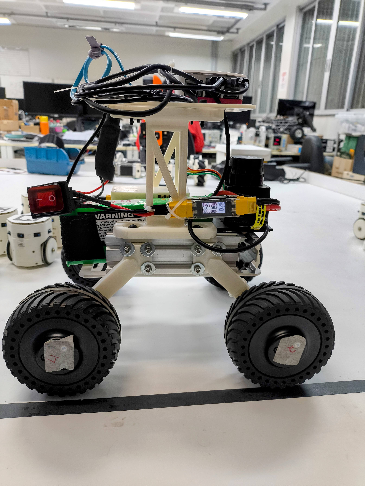
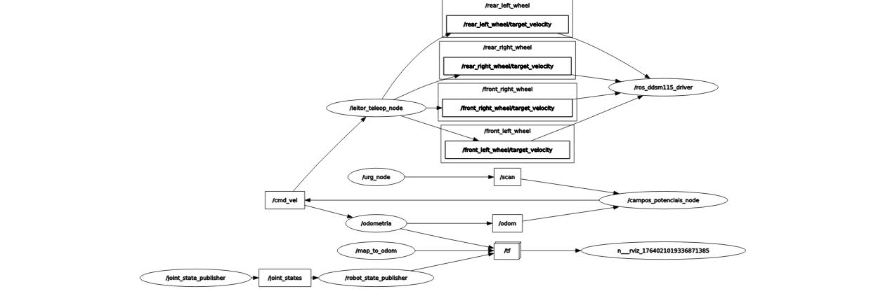

# Physical Robot — Potential Fields on Real Hardware

> Final project for the **Mobile Robotics** course, implementing autonomous navigation by potential fields on a custom-built skid-steering robot.

---

## Overview

This project consists of a physical mobile robot platform built from scratch to apply and validate, in real hardware, concepts studied throughout the Mobile Robotics course — particularly **potential fields-based navigation**.

The robot uses a **skid-steering** drivetrain and integrates:
- 4× **DDSM115 Direct Drive** motors controlled via a **DDSM Driver HAT (A)**
- A **Raspberry Pi 5** as the main computing unit
- A **Hokuyo URG-04LX-UG01** 2D LiDAR (5.6 m range, 240° FoV)
- **ROS 1** running inside a Docker container

---

| Front view | Side view |
|---|---|
|  |  |

---

## Software Architecture

The system runs **ROS 1** inside a Docker container using the `docker-compose` setup provided in the [VeRLab GitHub repository](https://github.com/verlab).

Two main ROS packages were developed:

| Package | Responsibility |
|---|---|
| `campos_potenciais` | Navigation logic (potential fields algorithm) |
| `ros_ddsm115_driver` | Motor control, Hokuyo integration, wheel odometry, robot kinematics |

### ROS Node Graph

 

The `/campos_potenciais_node` subscribes to `/scan` (LiDAR data) to compute repulsive/attractive forces and publishes target velocities to `/cmd_vel`. The `/leitor_teleop_node` allows manual keyboard teleoperation on the same topic.

---

## Kinematics & Odometry

Although the robot is mechanically a skid-steering platform, differential drive kinematics were adopted as an initial approximation, assuming equal velocities for wheels on the same side.

### Wheel speed conversion

$$\omega_{right} = \frac{2v + \omega L}{2r}$$

$$\omega_{left} = \frac{2v - \omega L}{2r}$$

Where:
- $v$ = linear velocity
- $\omega$ = angular velocity
- $L$ = wheelbase (distance between wheels)
- $r$ = wheel radius

### Wheel odometry

$$\Delta x = v \cos(\theta) \cdot dt$$

$$\Delta y = v \sin(\theta) \cdot dt$$

$$\Delta \theta = \omega \cdot dt$$

Where $dt$ is the time interval computed via `ros::Time::now()`.

---

## Potential Fields Navigation

The potential fields algorithm guides the robot toward a goal while repelling it from obstacles detected by the LiDAR. The `/campos_potenciais_node`:

1. Reads obstacle data from `/scan`
2. Computes attractive force toward the target position (read from `/odom`)
3. Computes repulsive forces from nearby obstacles
4. Publishes the resulting velocity command to `/cmd_vel`

---

### Running

```bash
# Clone the repository
git clone https://github.com/rafaelos134/Mobile-Robotics-Final-Project.git
cd Mobile-Robotics-Final-Project

# In the container, build the workspace
catkin_make
source devel/setup.bash

# Launch the full robot stack
roslaunch ros_ddsm115_driver ros_ddsm115_driver.launch

# In another terminal, launch potential fields navigation
roslaunch campos_potenciais campos.launch
```

---

## Experiments & Results

Experiments were conducted with cardboard barriers as obstacles. The robot was tasked with reaching an arbitrary goal position while avoiding obstacles.

**Physical robot results:**
- In most initial tests, the robot got stuck on the first obstacle, pointing to the need for parameter tuning in the potential fields algorithm.
- During testing, a rear wheel detached from the frame, damaging a motor cable and halting further physical tests.

**Simulation (CoppeliaSim):**
- After tuning the algorithm, a similar scenario was reproduced in CoppeliaSim using a Kobuki model (comparable wheel dimensions) with the same Hokuyo sensor.
- The simulated robot successfully reached the goal and correctly avoided all obstacles.

---

## Hardware Issues Encountered

| Problem | Impact |
|---|---|
| ESP32 board came with factory defect | Temporarily blocked wheel odometry |
| Voltage converter failure | Interrupted Raspberry Pi power supply |
| Rear wheel detached during tests | Damaged motor cable; halted physical experiments |

---

## Future Work

- Fix mechanical issues and reinforce the 3D-printed structure
- Add shock absorbers
- Replace differential drive kinematics with a proper **skid-steering kinematic model**
- Integrate additional sensors (e.g., IMU, depth camera)
- Apply localization techniques (e.g., AMCL, EKF-SLAM)
- Explore more advanced path planning algorithms

---

## References

1. T. Kim, S. Lim, G. Shin, G. Sim, and D. Yun, "An open-source low-cost mobile robot system with an RGB-D camera and efficient real-time navigation algorithm," *IEEE Access*, vol. 10, pp. 127871–127881, 2022.
2. A. Filho et al., "Robotic pipe inspection: Low-cost device and navigation system," *Journal of Control, Automation and Electrical Systems*, vol. 36, Dec. 2024.
3. H. Azpurua et al., "Espeleorobô – a robotic device to inspect confined environments," in *2019 19th International Conference on Advanced Robotics (ICAR)*, 2019, pp. 17–23.

---

## Author

**Rafael Santos Oliveira**
Mobile Robotics Course — Final Project
